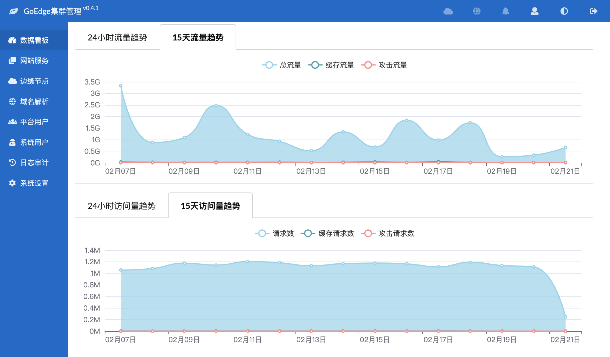
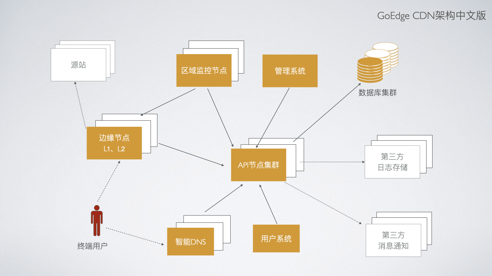

# GoEdge目标
做一款人人用得起的CDN & WAF系统。




## 声明 

该文档只做备份 超哥 最后 开源的版本!


## 特性
* `免费` - 开源、免费、自由、开放
* `简单` - 架构简单清晰，安装简单，使用简单，运维简单
* `高扩展性` - 可以自由扩展新的节点，支持亿级数据

## 功能介绍
* 多用户
* 日志审计
* 集群管理
* HTTP/HTTPS/TCP/UDP等协议支持
* WAF
* 缓存
* DNS自动解析
* 多域名绑定
* 免费证书申请
* IP黑白名单
* 访问日志
* 统计
* 内容压缩
* Protocol Proxy协议
* 本地静态文件
* URL跳转
* 路由规则
* 重写规则
* 访问控制
* 字符编码
* 自定义页面
* 自定义HTTP Header
* Websocket
* WebP自动转换
* Fastcgi
* 请求限制
* 流量限制

## 在线演示
* [http://demo.goedge.cn](http://demo.goedge.cn)

## 文档
* [新手指南](https://goedge.cn/docs/QuickStart/Index.md)
* [完整文档](https://goedge.cn/docs)
* [开发者指南](https://goedge.cn/docs/Developer/Build.md)

## 架构


其中的组件源码地址如下：
* [边缘节点](https://github.com/orglen/EdgeNode)
* [API节点](https://github.com/orglen/EdgeAPI)
* [管理平台](https://github.com/orglen/EdgeAdmin)

## 感谢
* 感谢 [Gitee](https://gitee.com/) 提供国内源代码托管平台


## 源码编译

## 整体源码结构
从Github上对应仓库下载各个组件的源码后，建议的整体源码结构为：

EdgeProject/
   EdgeAdmin     # 管理平台
   EdgeAPI       # API节点
   EdgeNode      # 边缘节点
   EdgeCommon    # 公共依赖
   ....


源码下载地址：

* GitHub: https://github.com/orglen ，一直保持最新

## 运行环境

* 操作系统：目前只支持macOS和Linux开发环境；
* MySQL：支持 v5.7.x 以上 / TiDB 3.0以上；
* Golang：支持 v1.21及以上；
* macOS X上需要安装musl交叉编译工具链，安装方法当前文档的下一段会给出。

### 安装musl交叉编译工具链

由于边缘节点启用了CGO_ENABLED，所以如果你是在macOS X上交叉编译Linux上的边缘节点，需要先在系统中安装musl库：

`brew install FiloSottile/musl-cross/musl-cross --with-x86_64 --with-aarch64 --with-arm-hf --with-i486 --with-arm --with-mips --with-mipsel --with-mips64 --with-mips64el`

这个安装过程最长可能需要几个小时，需要耐心等待。
如果在安装过程中总是提示下载失败，可以使用一个代理：

`export ALL_PROXY="127.0.0.1:7890”`


其中 127.0.0.1:7890 换成你自己的代理地址。
如果已经安装过但是支持的平台或架构不全，可以卸载后再安装：


```
brew uninstall FiloSottile/musl-cross/musl-cross
brew install ...
```

安装完成后，可以在 /usr/local/bin 和 /usr/local/opt/musl-cross/bin 下找到对应的文件。

## 公共依赖源码

EdgeCommon是各个组件公共依赖的源码，下载地址 https://github.com/orglen/EdgeCommon 。


## 编译各个组件

### 编译EdgeAdmin管理平台

从 https://github.com/orglen/EdgeAdmin下载EdgeAdmin源码；
从 https://github.com/orglen/EdgeCommon下载EdgeCommon源码，如果已经下载则不需要重复下载；
将EdgeAdmin和EdgeCommon放在同一目录下；
转到 EdgeAdmin 目录下；
执行 go mod download 下载项目依赖的源码；
复制 build/configs/server.template.yaml 到 build/configs/server.yaml，如果 server.yaml 已经存在则无需重复复制；这个文件里默认指定了管理平台的访问端口为7788，可以根据自己的需要进行修改；
复制 build/configs/api.admin.template.yaml 到 build/configs/api.admin.yaml；这个文件默认指定了API节点的端口为8003，在启动API节点时如果修改了端口号，也要在这里进行同步的修改；
运行 `go run -tags community cmd/edge-admin/main.go`


* 商业版源码请将 `-tags community` 换成 `-tags plus`

如果想编译整个项目，请参考 build/build.sh，比如可以运行：

`./build.sh linux amd64`

来编译linux/amd64版本的项目压缩包，编译后生成的压缩包可以在dist目录下找到。

> 注意: 开发测试时可先将 EdgeAPI API 打包 
> 打包后的 edge-api 
> 放入 EdgeAPI 目录 下  build/bin 文件下 如果没有就手动新建  将build 文件夹重命名为 edge-api 复制到 EdgeAdmin 下面的 build 文件夹 
> 回到EdgeAdmin目录执行 `go run -tags community cmd/edge-admin/main.go`  方便快速开发!


### 编译EdgeAPI API节点

API节点是唯一可以操作数据库的节点，所以需要在步骤中配置数据库，也是其他节点依赖运行的节点。

从 https://github.com/orglen/EdgeAPI下载EdgeAPI源码；
从 https://github.com/orglen/EdgeCommon下载EdgeCommon源码，如果已经下载则不需要重复下载；
将EdgeAdmin和EdgeCommon放在同一目录下；
转到 EdgeAPI 目录下；

执行 `go mod download` 下载项目依赖的源码；

复制 `build/configs/api.template.yaml` 到 `build/configs/api.yaml`，如果 `api.yaml` 已经存在则无需重复复制；然后修改其中的配置 nodeId 为API节点的ID，secret 为API节点的密钥；如果还没有创建过API节点，则可以在修改数据库配置（第7步）后，通过执行 `go run -tags community cmd/edge-api/main.go setup -api-node-protocol=http -api-node-host=127.0.0.1 -api-node-port=8003` 初始化数据库，然后在执行后的控制台提示或者数据库 edgeAPINodes中获取节点ID（字段uniqueId）和密钥（字段secret）；

商业版源码请将 `-tags community` 换成 `-tags plus`

复制 `build/configs/db.template.yaml 到 build/configs/db.yaml`，将其中的 `prod` 修改为 `dev`，并修改其中的数据库配置，通常是用户名、密码、MySQL数据库地址和端口；

运行 `go run -tags community cmd/edge-api/main.go`

商业版源码请将 `-tags community` 换成 `-tags plus`

如果想编译整个项目，请参考 `build/build.sh`，比如可以运行：

`./build.sh linux amd64`

来编译linux/amd64版本的项目压缩包，编译后生成的压缩包可以在dist目录下找到。
如果出现amd64之外的节点编译报错时，可以修改build.sh脚本，修改其中的：


`NODE_ARCHITECTS=("amd64" "386" "arm64" "mips64" "mips64le")`
为
`NODE_ARCHITECTS=("amd64")`

这样只编译amd64，大部分Linux系统应该是支持的。


自动集成数据库结构变更


如果你修改了数据库结构，希望用户在安装时自动升级老的数据库，你需要运行 build/sql.sh 脚本，自动从你的数据库中生成新的结构代码（internal/setup/sql.go文件），然后再运行build.sh来重新编译API节点。

对于开源版本，如果你想每次运行编译脚本的时候都自动运行sql.sh，可以修改build.sh中的：


```sh
if [ $TAG = "plus" ]; then
	echo "building sql ..."
	${ROOT}/sql.sh
fi
```

修改为：

```sh
if [ $TAG = "community" ]; then
	echo "building sql ..."
	${ROOT}/sql.sh
fi
```

即可

### 编译EdgeNode边缘节点

从 https://github.com/orglen/EdgeNode下载EdgeNode源码；
从 https://github.com/orglen/EdgeCommon下载EdgeCommon源码，如果已经下载则不需要重复下载；
将EdgeNode和EdgeCommon放在同一目录下；
转到 EdgeNode 目录下；
执行 `go mod download` 下载项目依赖的源码；
复制 `build/configs/api_node.template.yaml 到 build/configs/api_node.yaml`，如果 `api_node.yaml` 已经存在则无需重复复制；然后修改其中的配置；如果你还没有边缘节点，需要先运行EdgeAdmin并通过界面创建一个节点后再修改配置后运行边缘节点；
运行 `go run -tags community cmd/edge-node/main.go`

* 商业版源码请将 -tags community 换成 -tags plus

如果想编译整个项目，请参考 `build/build.sh`，比如可以运行：

`./build.sh linux amd64`

来编译linux/amd64版本的项目压缩包，编译后生成的压缩包可以在dist目录下找到。


## 常见问题


### 下载依赖的Go模块失败

go mod download 操作可能因为网络原因失败，如果失败，建议使用网络代理尝试重新下载：

`env https_proxy=127.0.0.1:7890 go mod download`

其中的 127.0.0.1:7890 换成你自己的网络代理地址。
或
`go env-w GOPROXY=https://goproxy.cn,direct`

如何编译Freebsd上的边缘节点

先确保bash命令存在：

`bash`

如果提示 bash: Command not found 则可以使用pkg命令安装：

`pkg install bash`

检查zip是否存在，如果不存在同样：

`pkg install zip`

然后可以在Freebsd系统中直接编译（需要先下载源码EdgeCommon和EdgeNode）：

`./build.sh freebsd amd64`


### Linux 下 EdgeNode 出现以下报错 

`webp.go:47:20: too many errors  webDecodeRGBA`

是缺少 GCC 安装 GCC

`sudo apt install build-essential`

windows 参考
https://jmeubank.github.io/tdm-gcc/


## 参考资料

* [Linux上使用musl-cross-make](https://github.com/richfelker/musl-cross-make)

* 安装前需要准备wget、patch、bzip2、gcc-c++等。


